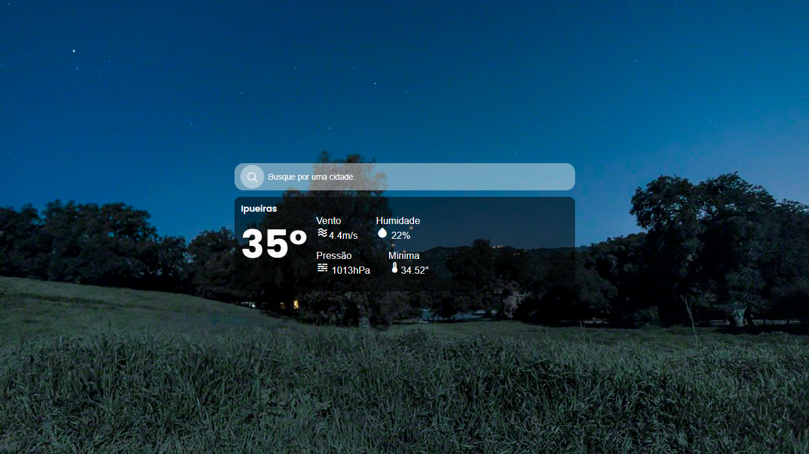

# Climafy

Projeto criado unicamente para estudo pessoal de funções JS, Consumo de Apis e CSS. É um pequeno site que te dá a temperatura e algumas informações climáticas sobre uma cidade que você poderá pesquisar.


[](https://choosealicense.com/licenses/mit/)


## 📸 Demonstração



## 📦 Rodando localmente

Clone o projeto

```bash
  git clone https://link-para-o-projeto
```

Entre no diretório do projeto

```bash
  cd my-project
```

Para visualizar o projeto você pode usar a Extensão **Live Server** ou um **servidor Apache (WAMP, LAMP, XAMP)**.

## API DA OPENWEATHER
# 🌤️ Guia para Obter sua API do OpenWeather

---

## 1️⃣ Criar Conta no OpenWeather

1. Acesse o site: [OpenWeather](https://openweathermap.org/) 🌐  
2. Clique em **Sign Up** 📝  
3. Preencha seus dados e confirme seu e-mail 📧  

---

## 2️⃣ Gerar sua Chave de API

1. Faça login na sua conta 🔑  
2. No menu, vá em **API keys** 🗝️  
3. Clique em **Create Key** ➕  
4. Escolha um nome para sua chave (ex: `MeuAppClima`) 🏷️  
5. Copie sua **API Key** 🧾 — você vai usar ela no seu código!  

---

## 3️⃣ Testando a API

APÓS ISSO, ADICIONE A API NO ARQUIVO script.js, na constante "chaveApi" (O mais seguro é configurar váriaveis de ambiente para guardar sua API, nesse caso, adicionei de forma direta no código.. Não estava focado em fazer algo """complexo""" usando node.js)

## 👤 Sobre o Autor

Olá! Eu sou **Narlison Rodrigues**, apaixonado por tecnologia, programação e soluções criativas para o dia a dia.  
Adoro criar projetos que sejam úteis, divertidos e fáceis de usar. 🚀  

Se quiser me acompanhar ou ver mais projetos, fique à vontade para visitar meu GitHub e redes sociais! 🌟  

**Instagram:** [@narlison.js](https://www.instagram.com/narlison.js)  
**LinkedIn:** [Narlison Rodrigues](https://www.linkedin.com/in/NarlisonRodrigues)  

---

Made with ❤️ by Narlison


